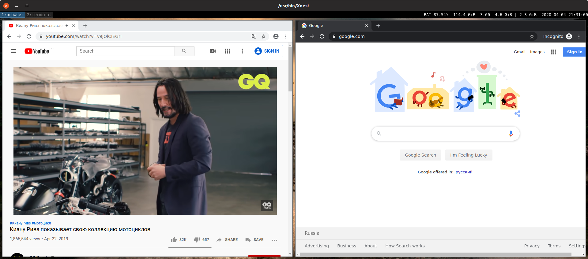
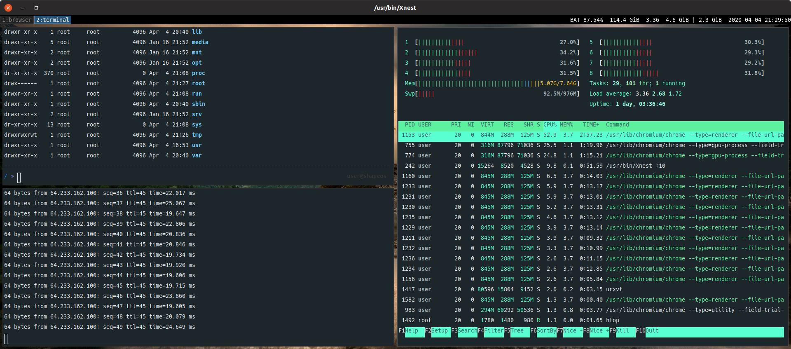
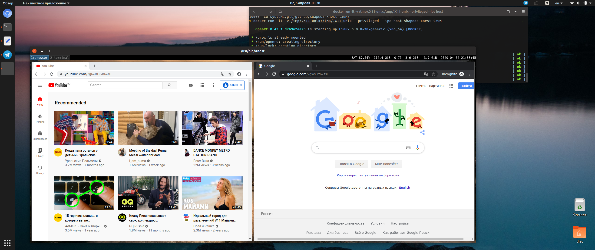

# Alpine desktop on i3wm

X window system in docker container

- based on [Alpine Linux 3.11](https://alpinelinux.org/)

- X serger [Xephyr](https://freedesktop.org/wiki/Software/Xephyr/)

- window manager [i3wm-gaps](https://github.com/Airblader/i3)

- internet browser [Chromium](https://www.chromium.org/)

- terminal emulator [RXVT](http://rxvt.sourceforge.net/)

- zsh theme [ohmyzsh](https://github.com/ohmyzsh/ohmyzsh)

## Get

```
git clone git@github.com:d00t-b-res/ShapeOS-Xnest-i3wm.git
```

## Build

```
docker build -t shapeos-xnest-i3wm .
```
or Docker hub:

```
docker pull bres/shapeos-xnest-i3wm:latest
```

## Configure

Allow connections for your X11 server
use:
```
xhost +localhost
```

## Run
```
docker run -it -v /tmp/.X11-unix:/tmp/.X11-unix --privileged --ipc host shapeos-xnest-i3wm
```

## Run with persistent sotrage
```
docker run -it -e GEOMETRY=1280x720  -v /var/lib/shapeos-xnest-i3wm2:/persistent -v /tmp/.X11-unix:/tmp/.X11-unix --privileged --ipc host shapeos-xnest-i3wm
```
## Eenvironments

| Env        | Value           | Description  |
| ------------- |:-------------:| -----:|
| GEOMETRY     | 1280x720 | window size |

## Screenshots 





